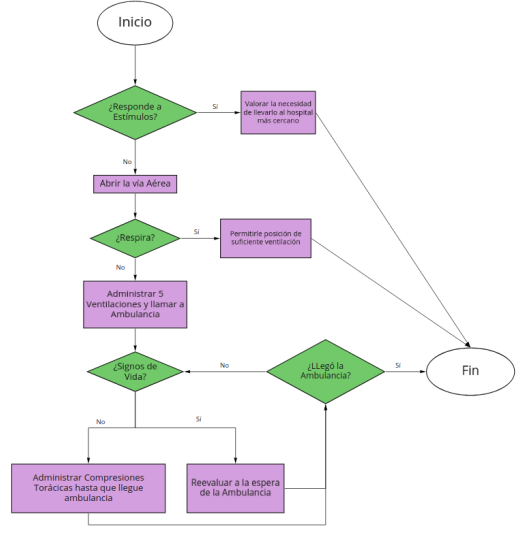

## Desafío - Sentencias condicionales e iterativas (II)

En este desafío, resolvimos tres actividades que involucran el uso de sentencias condicionales e iterativas.

### Actividades

#### Actividad 1 - Filtrado compacto

En esta actividad, se nos solicita crear un programa llamado `mayor_a.py` que devuelva un informe resumido exponiendo los meses que superan un cierto umbral de ventas. Se proporciona un diccionario `ventas` con los balances del año anterior. El programa debe retornar un diccionario con los meses y sus ventas asociadas que superen el umbral especificado por el usuario.

#### Actividad 2 - Primeros auxilios

Para esta actividad, se requiere la construcción de una aplicación interactiva llamada `primeros_auxilios.py` que entregue los distintos pasos a seguir dependiendo de las respuestas que el usuario entregue en tiempo real. Se provee un diagrama que explica las distintas instancias a las que se está sometido durante una emergencia.

#### Actividad 3 - Fuerza bruta

En este desafío, debemos determinar cuántos intentos son necesarios para encontrar combinaciones numéricas en minúscula. El programa `fuerza_bruta.py` debe intentar todas las combinaciones de letras posibles, en orden alfabético, hasta que la combinación de letras sea igual a la de la contraseña indicada. Deberá hacer este proceso letra por letra, de izquierda a derecha.

### Requerimientos

**Actividad 1 - Filtrado compacto:**

- Crear un programa llamado `mayor_a.py` que devuelva un informe resumido exponiendo los meses que superan un cierto umbral de ventas.
- El programa debe solicitar al usuario el umbral deseado como dato de entrada.
- Se debe retornar un diccionario con los meses y sus ventas asociadas que superen el umbral especificado.

**Actividad 2 - Primeros auxilios:**

- Construir una aplicación interactiva llamada `primeros_auxilios.py` que entregue los distintos pasos a seguir dependiendo de las respuestas que el usuario entregue en tiempo real.

**Actividad 3 - Fuerza bruta:**

- Determinar cuántos intentos son necesarios para encontrar combinaciones numéricas en minúscula.
- El programa `fuerza_bruta.py` debe intentar todas las combinaciones de letras posibles, en orden alfabético, hasta que la combinación de letras sea igual a la de la contraseña indicada.
- Deberá hacer este proceso letra por letra, de izquierda a derecha.

### Autor
[GabrielRecabarren](https://github.com/GabrielRecabarren)

